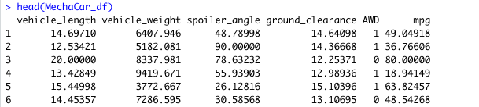
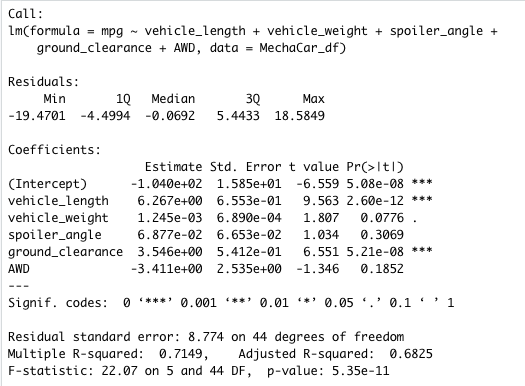
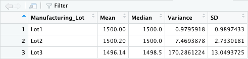
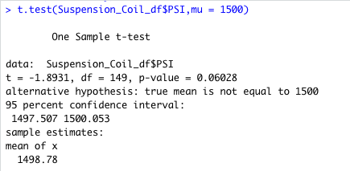
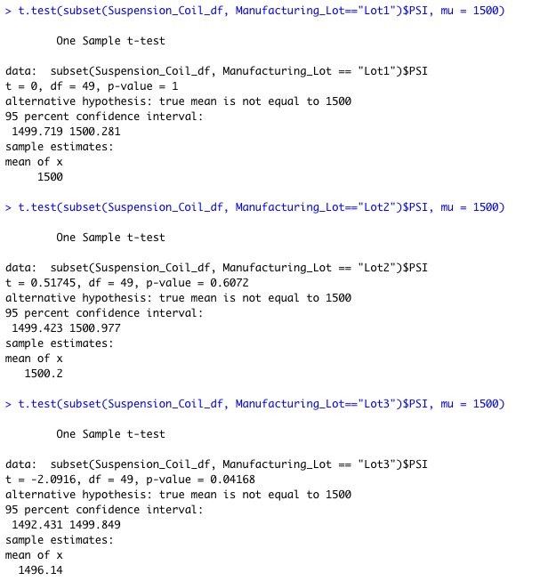

### MechaCar_Statistical_Analysis

## Overview
The purpose of this project was to undertake some statistical analysis using the R programming language to assist AutosRU, a company with "MechaCar" prototype with some statistical exploratory analysis such as linear regressions and t-test analysis. The datasets used were MechaCar_mpg.csv and Suspension_Coil.csv which were loaded into the Rstudio programming tool. The `dplyr` library package was installed as well.

# Linear Regression to Predict MPG

The MechaCar_mpg.csv dataset was read and a snippet showing the columns follows below:
  
  
  
The summary results of the multiple linear regression to predict MPG is presented below with some questions answered.

  
  
- Which variables/coefficients provided a non-random amount of variance to the mpg values in the dataset?

The variable coefficients which provided a non-random amount of variance to the mpg values are the statistically significant variables which had P-values less the significance level of 5 percent. These variables were `vehicle_lenth` and `ground_clearance`. The remaing variables were not statistically significant at 5 percent.
- Is the slope of the linear model considered to be zero? Why or why not?

The slope of the linear model is not considered to be zero as the P-value (5.35e-11 was less than the significance level at 5 percent thus there was enough evidence to reject the null hypothesis which stated "the slope was equal to zero".

- Does this linear model predict mpg of MechaCar prototypes effectively? Why or why not?

The linear model does predict mpg of MechaCar prototypes effectively. This is measured by the R-squared which was approximately 71 percent.  This meant that 71 percent of the variability in MPG could be explained by the variability in the independent variables of the linear regression thus the model having a good fit and doing a good job in it's predictive ability.

## Summary Statistics on Suspension Coils
The Suspension_Coil.csv dataset was loaded and summary statistics for mean, median, variance and standard deviation of the suspension coil’s PSI were examined. Results are below:
- Total lots summary stats

- Individual lots summary stats

  
- The design specifications for the MechaCar suspension coils dictate that the variance of the suspension coils must not exceed 100 pounds per square inch. Does the current manufacturing data meet this design specification for all manufacturing lots in total and each lot individually? Why or why not?

The current manufacturing data does meet the design specification of variance of the suspension coils not exceeding 100 pounds per square inch for all manufacturing lots in total. However, that of lot 3 exceeds the requirement as the variance is 170 and thus will need to be examined further.
  
## T-Tests on Suspension Coils

T-test statistics was run to compare all manufacturing lots and each manufacturing lot against mean PSI of the population. Results are below:

- From the result, it can be observed that the P-value is not statistically significant at 5 percent signifance level thus not enough evidence to reject the null hypothesis. This means the mean PSI for all lots is not different from the mean PSI of the population.

- From the result, it can be observed that the P-value for lot 1 is not statistically significant at 5 percent signifance level thus not enough evidence to reject the null hypothesis. This means the mean PSI for lot 1 is `not different` from the mean PSI of the population.

- From the result, it can be observed that the P-value for lot 2 is not statistically significant at 5 percent signifance level thus not enough evidence to reject the null hypothesis. This means the mean PSI for lot 2 is `not different` from the mean PSI of the population.

- From the result, it can be observed that the P-value for lot 3 is statistically significant at 5 percent signifance level thus there is enough evidence to reject the null hypothesis. This means the mean PSI for lot 1 is `different` from the mean PSI of the population.

## Study Design: MechaCar vs Competition

Another study can be conducted to analyze how MechaCar performs relative to competition in the market. This could yield interesting results that will better help improve the MechaCar prototype.

- Choosing a metric to test:
A metric to consider testing will be the maintenance cost and safety ratings of MechaCar relative to its competition. As this study has already examined the city or highway fuel efficiency (MPG), other exploratory variables will be very helpful.

- What is the null hypothesis or alternative hypothesis?
Ho: There is no statistical difference btween the mean safety ratings of MechaCar and its competition.
Ha: The mean safety ratings of MechaCar is greater than the mean safety ratings of its competion.

- What statistical test would you use to test the hypothesis? And why?
The recommended statistical test will be the two-tail sample t-test statistics to compare mean safety ratings of MechaCar with its competition. The t-test provides results from which usefull inferences can be made.

- What data is needed to run the statistical test?
A dataset on the safety ratings, maintenance cost, MPG, vehicle_length, vehicle_weight, and ground_clearance can be collected for this further exploratory analysis. Analysis will be conducted in RStudio.

